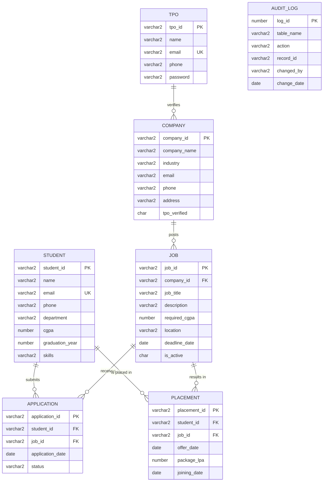

# Student Placement Management System - Database Schema Documentation

This document provides a comprehensive overview of the database schema designed for the Student Placement Management System.

## 1. Entity-Relationship (ER) Diagram

The following diagram illustrates the tables and their relationships within the system.

---

## 2. Data Dictionary

### Table: `STUDENT`
Stores personal and academic details of students.
- `student_id`: Unique identifier for each student (Primary Key).
- `name`: Full name of the student.
- `email`: University email address (Unique).
- `cgpa`: Cumulative Grade Point Average (0.0 to 4.0).
- `skills`: Comma-separated list of technical skills.

### Table: `COMPANY`
Stores information about recruiting companies.
- `company_id`: Unique identifier for the company (Primary Key).
- `tpo_verified`: Boolean flag ('Y'/'N') indicating if the company is verified by the TPO.

### Table: `JOB`
Stores details of job openings posted by companies.
- `job_id`: Unique identifier for the job (Primary Key).
- `required_cgpa`: Minimum CGPA required to apply for the job.
- `is_active`: Status of the job posting ('Y' for active, 'N' for closed).

### Table: `APPLICATION`
Tracks applications submitted by students for specific jobs.
- `status`: Current stage of the application (Pending, Shortlisted, Selected, Rejected).

### Table: `PLACEMENT`
Stores final placement/offer details for successful candidates.
- `package_lpa`: Salary package offered in Lakhs Per Annum.

---

## 3. Advanced SQL Features

### Views
1. **`vw_job_applications`**: Summarizes the total number of applications and the average applicant CGPA for each job.
2. **`vw_dept_placement_stats`**: Provides placement percentages and average CGPA of placed students per department.

### Triggers
- **`trg_application_audit`**: Automatically logs every new application into the `AUDIT_LOG` table for tracking and security purposes.

### Stored Procedures
- **`sp_apply_job`**: A robust procedure that validates a student's eligibility (CGPA check, deadline check) before allowing them to apply for a job.
